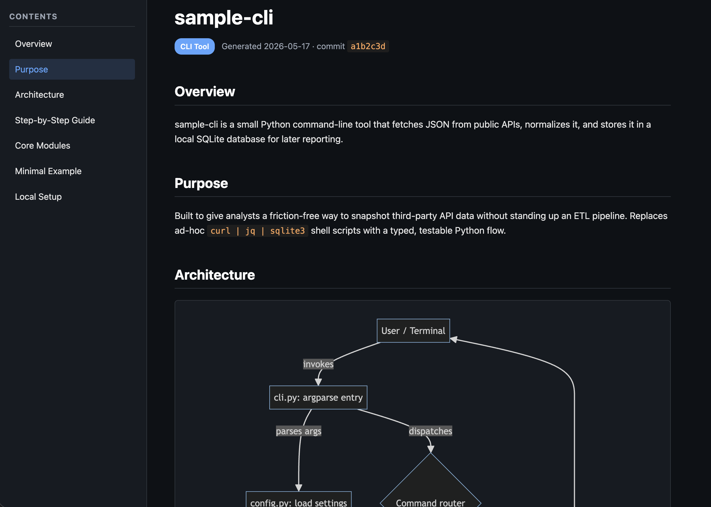

# repo-study-guide

A dual Claude Code + Codex skill that analyzes any repository and generates a self-contained, dark-themed HTML study guide with an architecture diagram.

Drop it on an unfamiliar codebase and get a one-page visual onboarding doc: overview, purpose, data flow, core modules, minimal runnable example, and a Mermaid architecture diagram — all in a single HTML file.

Tested with Codex and Claude Code.



## What it produces

```
docs/
├── study_guide.html      # self-contained, dark theme, sidebar TOC, scrollspy
└── architecture.mmd      # Mermaid source of the architecture diagram
```

The HTML embeds Mermaid + highlight.js from CDN with graceful offline
degradation. Architecture diagrams render inside a scrollable viewport with
zoom controls so larger graphs remain readable.

## Installation

### As a skill for Claude Code or Codex

For Claude Code:

```bash
git clone https://github.com/gastonmira/repo-study-guide.git ~/.claude/skills/repo-study-guide
```

For Codex:

```bash
git clone https://github.com/gastonmira/repo-study-guide.git ~/.codex/skills/repo-study-guide
```

Then in either agent, the skill can be triggered naturally:

```
analyze this repo and generate a study guide
```

In Codex, you can also invoke it explicitly with:

```
$repo-study-guide
```

In Claude Code, you can also invoke it explicitly with:

```
/skill repo-study-guide
```

Or use related prompts like *"generate a study guide"*, *"explain this codebase"*, or *"onboard me to this project"*.

### As a reference for other agents (Cursor, Aider, Hermes, custom)

Copy `SKILL.md` into your agent's instruction set or system prompt. The template lives in `templates/study_guide_template.html` — point your agent at it.

## Usage

From inside any repo:

```
> analyze this repo and generate a study guide
```

The skill will:

1. Scan the file tree and identity files (`README`, `package.json`, etc.).
2. Detect project type (CLI / Web App / Library / ML / Monorepo).
3. Trace the entry point and data flow.
4. Generate `docs/architecture.mmd` and `docs/study_guide.html`.

Open the HTML in any browser — no build step.

## Output sections

| Section | Content |
|---|---|
| Overview | What the project does (2–3 sentences) |
| Purpose | Why it exists / problem it solves |
| Architecture | Rendered Mermaid diagram |
| Step-by-Step | Ordered data-flow trace |
| Core Modules | Table of key files + 1-sentence role |
| Minimal Example | Smallest runnable snippet |
| Local Setup | Install + run commands |

## Customization

Edit `templates/study_guide_template.html` to change theme, layout, or sections. Placeholders use `{{SNAKE_CASE}}` syntax — see `SKILL.md` for the full list.

To change the output directory, ask the skill explicitly: *"generate the study guide into `wiki/` instead of `docs/`"*.

## Token efficiency

Analyzing an unfamiliar repo can burn a lot of tokens if the agent re-reads every file it touches. The skill keeps the bill low through two complementary mechanisms:

### Structural graph (opt-in)

If the host agent exposes the [`code-review-graph`](https://github.com/tirth8205/code-review-graph) MCP server, the skill tries the graph before broad file exploration:

- `get_architecture_overview_tool` replaces manual folder scanning.
- `get_hub_nodes_tool` + `list_communities_tool` pick the 3–7 core files without grep sweeps.
- `list_flows_tool` + `get_flow_tool` locate entry points and trace the main data flow.
- `semantic_search_nodes_tool` handles targeted symbol lookups before falling back to `rg`.
- `get_minimal_context_tool` / `get_review_context_tool` pull only the lines needed for the template, not full files.

Graph data is only used as an architectural source when coverage is
representative. The skill compares graph stats with a shell file count and
treats the graph as low coverage if it indexes no files, only a tiny subset of
the repo, or mostly tests. In that case it omits graph-derived summaries and hub
ranks, then falls back to focused shell/file exploration.

No hard dependency: if any graph tool errors, the MCP isn't installed, or graph
coverage is too narrow, the skill falls back to the shell-based flow
automatically.

### Subagent delegation for large repos

The skill measures the repo first with a shell file count and, when available,
graph stats. Repos with **>500 files** default to spawning an `Explore` subagent
with a fixed brief prompt. The subagent's context is discarded once it returns
the structured summary, so the main conversation never loads the full project.
Repos under the threshold use the inline flow.

The two mechanisms compose: a large repo with representative graph coverage gets
both — the subagent itself uses graph queries inside its isolated context.

## Edge cases handled

- **Monorepos** — generates one guide per workspace under `docs/<package>/`.
- **No README** — infers purpose from package metadata; marks as `(inferred)`.
- **Large repos (>500 files)** — delegates exploration to a subagent/explorer when the host agent supports it.
- **Empty / scaffolding repos** — produces a minimal guide with next-step suggestions.

## Examples

See [`examples/`](examples/) for a sample output generated against a real repo.

## Contributing

Issues and PRs welcome. Particularly useful contributions:

- New template themes (light, sepia, print-friendly).
- Better project-type detection heuristics.
- Adapters for other agent frameworks.

## License

MIT — see [LICENSE](LICENSE).
